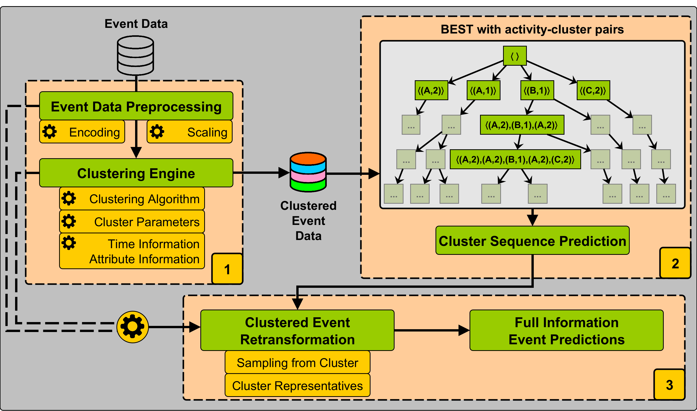

# Event Clustering for Efficient and Context-Aware Event Sequence Prediction

This is the implementation accompanying the paper 'Event Clustering for Efficient and Context-Aware Event Sequence Prediction' by Simon Rauch, Daniel Schuster, Gabriel Tavares and Thomas Seidl submitted to the CAiSE Conference 2026

## Framework

We provide a prediction framework EC-Pred to efficiently forecast full future event information of running business processes. The framework itself builds single event clustering of business process data which is then fed into a sequential-pattern-based forecasting algorithm presented in previous work [[R1]](#R1). Our framework is capable of predicting next activities, complete remaining activity traces as well as any accompanying event attribute considered in the event clustering phase.

## Setup

We implemented our approach as a combination of two python modules (`contextppm` and `best4ppm`) and provided an overall forecasting script to reproduce our experimental results.
To setup the environment for running our code, we provide a `pyproject.toml` file (requires python>3.12) from which the needed dependencies can be gathered with `pip` via (execute from the project directory):

`python -m pip install .`

or with [`poetry`](https://python-poetry.org/) via (execute from the project directory):

`poetry install`

## Usage

The codebase consists of our module `contextppm` and the previously published module `best4ppm` ([link](https://github.com/lmu-dbs/BEST) to the repository) and different scripts for dataset manipulation (`BPI2012_conversions.py`), event log metric extraction (`log_characteristics.py`) and the experiments for the prediction of next activities, activity suffixes and accompanying event attributes (`event_clustering.py`).

We also provide a set of config files, which are populated with the needed setup to reproduce our experimental results (`general_config.yaml`, `model_configs.yaml`, `data_configs.yaml`).

### Config

The general config sets the parameters for the main prediction loop. You can specify the datasets you want to analyze (`dataset` either as list of multiple or string of a single dataset), the evaluation strategy (i.e., cross-validation with `cv_folds` > 1 or single split with `cv_folds`==1 alongside the desired 'train_pct' specifying the share of cases you want to use for training) and the model configuration (`model_config`). For multiprocessing you can set the number of cores you want to use for the evaluation (`ncores`).

The general config file is linked to the remaining config files. With `dataset` you access the different data configurations matched by the dataset name. The data config file specifies the dataset filename (`file_name`), the relevant column identifiers (`case_identifier`, `activity_identifier`, `timestamp_identifier`) as well as the information incorporated into the event clustering by specification of the respective preprocessing and scaling options (`transform_params` and `encoding_params`). The entries inside `encoding_params` need to be distinct across the given options of `OneHotEncoder`, `StandardScaler`, `MinMaxScaler` and `RobustScaler`.

The model config file holds the model-specific parameters for model training. Our model has different parameters: 

- `max_pattern_size_train`/`max_pattern_size_eval`: specifying the depth of the tree (train) and the maximum traversal depth in the evaluation loop (eval). The depth is specified via the maximum allowed subtrace pattern size where the (pattern size - 1)/2 is the depth of the tree.

- 'process_stage_width_percentage': The main parameter for the number of process stages. The number of process stages is statically determined by calculating the process stage width via the percentage of the maximum trace length we see in the training data. A value of zero results in `n` process stages of width 1 with `n` being the maximum trace length we see in the training data, i.e., n BEST models. A value of 1 results in a single process stage, i.e., one trained BEST model.

- `task`: the tasks you want to perform. `nep` performs Next Event Prediction and `sfx` performs Suffix Prediction (can also be passed as a list of both tasks)

- `min_freq`: cutoff frequency for subtrace patterns. A value close to zero prevents filtering of subtrace patterns. We set this to 10e-15 in our experiments.

- `break_buffer`: the predicted sequence length at which the prediction loop is terminated in terms of `break_buffer` times the maximum trace length we see in the training dataset. We set this to 1.2 in our experiments.

- `prune_func`: A prune function for tree pruning. This is not applied/implemented currently

- `filter_sequences`: this filters the padded dummy activity tokens from the predicted sequences for evaluation. Should be set to `True` for a sound evaluation of predictive performance.

### Full Event Prediction with EC-Pred

We provide a script for complete recreation of the experiments presented in the paper. The script performs the model training for the given parameters in the config files and subsequently performs Next Event Prediction and Suffix Prediction for the test instances including the evaluation by accuracy, similarity and error metrics (for attribute prediction -- we forecast next timestamps and remaining times until case completion). We recommend to alter the model configuration in the `model_configs.yaml` or to use model configuration `test_config` for testing of the pipeline as the full experimental evaluation performs training and predictions for an exhaustive set of parameter combinations.

After a correct setup of the environment, execution of `event_clustering.py` executes the complete training, prediction and evaluation pipeline:

`python src/event_clustering.py`

In the current configuration the following pipeline is performed:

- Generation of 5 folds of training and test data for the 5-fold cross validation experimental setting
- For the different parameter combinations of `clustering_type` and `n_clusters` in the model configuration, a model training loop is performed based on the resulting clustering and for each fold with `max_pattern_size_train` of 21 resulting in a tree with patterns of length 21, i.e., 10 preceding activities, the center activity and 10 suceeding activities
- Predictions are generated for each parameter value given for `max_pattern_size_eval` and for each fold
- The total number of prediction/evaluation runs is specified by `|max_pattern_size_eval|*|n_clusters|*|clustering_type|*|cv_folds|`
- The average accuracy/similarity/error can be calculated by averaging the achieved performance metrics across all folds for one combination of `max_pattern_size_eval` and `process_stage_width_percentage`

## Included Event Log Datasets

- We provide the analyzed datasets in the `data/` folder:
	- `Helpdesk.csv` [[D1]](#D1)
	- `BPI2012.csv` [[D2]](#D2) 
	- `BPI2013_closed.csv` [[D3]](#D3)
	- `BPI2013_incidents.csv` [[D4]](#D4)
	- `env_permit.csv` [[D5]](#D5)
	- `sepsis.csv` [[D6]](#D6)
	- `nasa.csv` [[D7]](#D7)
- We added a script for data manipulation of the BPI Challenge 2012 event log. The event logs created for analysis are:
	- `BPI2012_Full.csv`: BPI Challenge 2012 with an augmented activity identifier consisting of the raw activity names and the lifecycle information (SCHEDULE, START, COMPLETE)
	- `BPI2012_W.csv`: A subset of the `BPI2012_Full.csv` where we only consider the workflow information, i.e., activities with the `W_` prefix
	- `BPI2012_C.csv`: A subset of the `BPI2012.csv` where we only consider the activities with `COMPLETE` lifecycle information
	- `BPI2012_WC.csv`: A subset of the `BPI2012_C.csv` where we only consider the workflow information, i.e., activities with the `W_` prefix
	- We provide analyses on the logs `BPI2012_W.csv`, `BPI2012_C.csv` and `BPI2012_WC.csv`

## References

<a id="R1">[R1]</a> Rauch, Simon, Frey, Christian M. M., Maldonado, Andrea, & Seidl, Thomas. (2025). BEST: Bilaterally Expanding Subtrace Tree for Event Sequence Prediction. In Lecture Notes in Computer Science (pp. 415–432). Springer Nature Switzerland. https://doi.org/10.1007/978-3-032-02867-9_25 

## Dataset References

<a id="D1">[D1]</a> Polato, Mirko (2017). Dataset belonging to the help desk log of an Italian Company (Link: <https://data.4tu.nl/articles/_/12675977/1>)

<a id="D2">[D2]</a> van Dongen,  Boudewijn (2012). BPI Challenge 2012 (Link: <https://data.4tu.nl/articles/_/12689204/1>)

<a id="D3">[D3]</a> Steeman, Ward (2013). BPI Challenge 2013, closed problems (Link: <https://data.4tu.nl/articles/_/12714476/1>)

<a id="D4">[D4]</a> Steeman, Ward (2013). BPI Challenge 2013, incidents  (Link: <https://data.4tu.nl/articles/_/12693914/1>)

<a id="D5">[D5]</a> Buijs, Joos (2022). Receipt phase of an environmental permit application process (WABO),  CoSeLoG project (Link: <https://data.4tu.nl/articles/_/12709127/2>)

<a id="D6">[D6]</a> Mannhardt,  Felix (2016). Sepsis Cases - Event Log (Link: <https://data.4tu.nl/articles/_/12707639/1>)

<a id="D7">[D7]</a> Leemans,  Maikel (2017). NASA Crew Exploration Vehicle (CEV) Software Event Log (Link: <https://data.4tu.nl/articles/_/12696995/1>)
